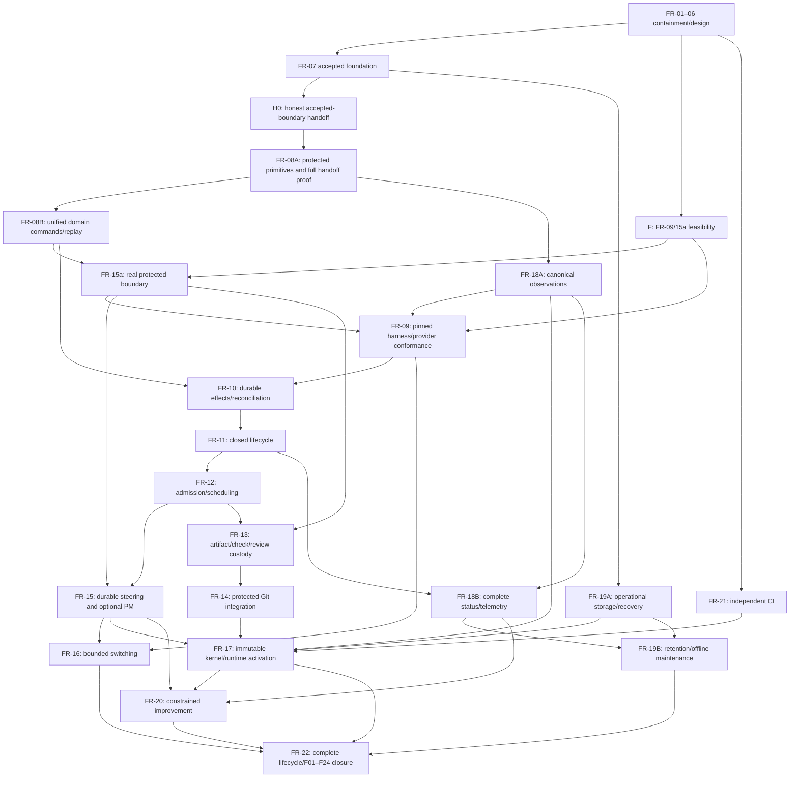

# Independent Foundry alignment audit

Audited revision: `2f603675e3feb1a65f0ce57a3bd69aa93deec29d`.
Tree: `73bc4bd386cf67d61cf8563814a45d1c1c9e0af0`.
Prepared 2026-09-19, Pacific/Honolulu, by the fresh independent
`/root/foundry_alignment_audit` session. This is a read-only audit and a proposed
disposition for the coordinator. It changes no backlog, contract, runtime, policy,
credential, Git ref, deployment or activation permission. Only this report is written.

## 1. Executive verdict and principal risks

**Continue repair, with a tighter decomposition and selective replacement of the old
workflow connections. A ground-up rewrite is not justified by the evidence. Keep
FR-07 complete for its independently accepted storage boundary. Do not declare the
current FR07→FR08 handoff ready or resume FR-08 under its present prerequisite text.**

The accepted design has a coherent central idea: models propose useful work, while
protected code owns authority, durable identity, budget conservation, effect issuance,
evidence and acceptance. OTP and SQLite remain appropriate implementation choices for
that idea. The current source still lacks the unified workflow and real isolation that
would make those contracts operational. Those are substantial remaining implementation
tasks, not evidence that prompting can replace the missing guarantees.

The strategy, Pi candidate design and project-profile direction mostly respect the
accepted operating contract. Their explicit non-adoption and post-repair qualifications
matter. The practical danger is expanding these designs into another general harness,
tool gateway and configurable workflow platform before proving one useful isolated
software lifecycle. The immediate next investment should settle the actual public
storage handoff and execution feasibility, then implement the narrow lifecycle.

| Priority | Finding | Consequence and disposition |
|---|---|---|
| P1, current demonstrated regression | `ProcessGroup.gone?/1` identifies death by `String.contains?(command, "defunct")`. A running BEAM with that text in argv is reported gone. | A stale-identity cancellation or failed group signal can be reported successful without proving absence. Correct under FR-04/FR-10 ownership before reusing this primitive as termination evidence. Historical FR-04 PASS remains historical; current certification must include the correction. |
| P1, concrete dependency contradiction | The handoff gate demands usable receipts, leases, policy/control revisions and authenticated inbox sequence/seal facts. FR-07 explicitly rejects retained rows in several of those tables and has no inbox-seal API. | A thin adapter cannot make all seven capabilities pass honestly. Split foundation handoff evidence from FR-08 protected-interface completion, preserving every requirement. No direct SQL or synthetic-pass adapter. |
| P1, feasibility/investment risk | Neither OMP nor Pi is proved to support the required subscription-only, credential-separated, pre-request reservation path on this host. | Advance bounded FR-09/15a feasibility investigation before large workflow or ergonomic investment. An unsupported official route keeps automatic execution blocked; no credential-copying or paid fallback workaround. |
| P1, remaining known implementation gap | Application/Coordinator still run the contained JSONL workflow; live State/Tick/PM mutations and `Transition` replay remain separate. | FR-07 is not live workflow migration. FR-08 needs a command-ingress inventory, one reducer and root-derived protected facts. Repeatedly patching individual legacy transitions would preserve the original architectural defect. |
| P1, evidence preservation risk | Reviewed identities survive as documents/objects, but older integration commits and the original v9 commit are not ancestors of current HEAD. Independent v9 probes remain only under `/private/tmp`. | Preserve exact blobs and explicit incorporation mappings. Archive reproducible support before temporary evidence is lost. Do not infer provenance from ancestry or a PASS filename alone. |
| P2, current status/document drift | FR-07's inventory row still says active although its completion section says complete. README still calls migration tickets authoritative and describes a live self-healing inventory. | Reconcile current routing/status now; retain dated historical accounts. Source containment and an uninspected running release must remain distinct. |

This review found no new contradiction requiring removal of FR-06 R1–R5: issued-effect
ordering, separate authenticated harness/tools, autonomous kernel repair under a fixed
root, guarded lifecycle/result precedence and conserved ledgers remain defensible.
Their implementation is not established by the design review or by FR-07's storage tests.

## 2. Ticket-by-ticket disposition

The actual backlog has **23 nodes: FR-01 through FR-22, plus FR-15a**. It has no FR-23
or FR-24. F23 and F24 are audit findings owned by FR-04/21/22. The two final rows below
explicitly resolve the requested FR-01–FR-24 inventory without inventing tickets.
KEEP means retain the ticket and its obligations, not certify every current code path.
Proposed A/B slices remain children of their original ID, subject to coordinator review.

| Ticket | Disposition | Completion/evidence validity | Dependency or scope change proposed |
|---|---|---|---|
| FR-01 | KEEP | Reviewed static containment remains valid. `LaunchEligibility` and production System `:unsupported` gate still exist; no real automatic-route proof. | Preserve FR-09/15a/16 restoration obligations. Translate profile policy only after a reviewed harness substitution. |
| FR-02 | KEEP | Integrated inert wrapper/RPC source matches its historical reviewed implementation. It still requires general release RPC authority. | Keep until FR-15a's scoped protocol replaces transport authority; retain hostile-input regressions after replacement. |
| FR-03 | KEEP | Exclusive startup, checked legacy persistence and recovery containment remain reusable. Runtime-owner changes are later FR-04 cleanup/shutdown work, not original FR-03 bytes. | Keep external-effect fencing in FR-10/15a and remove superseded append authority only during FR-08 migration. SQLite locking alone does not replace it. |
| FR-04 | CHANGE | Historical reviewed owned-cleanup containment remains credited. Current `gone?` change at `3759731` introduces an independently reproduced false-death predicate. | Add a bounded current-revision correction and regression evidence, then revalidate its caller in Checks.Runner. FR-10 retains full incarnation/descendant/channel reconciliation. |
| FR-05 | KEEP | Legacy integration and mutable-source activation still refuse; inspected Pipeline/watcher/handoff/review boundary files match accepted containment. | No early re-enablement. Restore only through FR-13/14/17 and protected isolation. |
| FR-06 | CHANGE | Design gate remains complete; v3 contract hash and focused R4a review hash match the accepted records. No fresh architecture reset warranted. | Amend only affected interface/sequencing precision and any selected harness/topology substitution. Re-review those changes; preserve R1–R5 and autonomous kernel-update scope. |
| FR-07 | KEEP | Complete for accepted v9 foundation; 56/56 original manifest entries verified against original reviewed object. Current HEAD differs only in README within that manifest. No storage regression found by this audit. | Correct inventory status. Explicitly distinguish foundation from unsupported protected lifecycle tables/APIs. Preserve FR-08, FR-15a, FR-19 and FR-22 duties. |
| FR-08 | SPLIT | Open. Gate harness works; no accepted-store adapter and no full domain kernel exist. Current readiness prerequisite is impossible to satisfy with glue alone. | FR-08A: protected primitive/schema/kernel interface completion and substantive handoff probes. FR-08B: all command ingress, one live/replay reducer and removal of competing mutation authorities. Handoff reconciliation precedes implementation under revised plan. |
| FR-09 | CHANGE | Open; no installed OMP/Pi subscription/isolation evidence. Pi document is an evaluation candidate. | Add an early bounded joint FR-09/15a feasibility checkpoint; use one execution/observation contract, Pi first. Completion still requires FR-15a, explicit contract revision if substituted, pinned real-route evidence and useful completion. |
| FR-10 | KEEP | Open. Existing checkpoint/process helpers are reusable only after conformance; no durable issued/unknown/terminal broker is wired. | Require FR-08B and FR-09/15a before completion. Develop model-free fault traces against fixed interfaces. Include non-session effects and the current false-death regression. |
| FR-11 | KEEP | Open. Current correction can still re-prompt an old developer while workflow work is queued; timeout/result cleanup paths remain specialized. | Preserve R4/R4a role-specific non-start, valid-result precedence, stream sealing, immutable terminal dispositions and bounded reviewer retry. Depends on FR-10. |
| FR-12 | KEEP | Open. Tick still bypasses `Scheduler.plan_dispatch` and can charge generic launch retries at supervisor saturation. | Wire the scheduler/common admission after FR-08B/10/11. Require capacity-one developer→checks→review success, plus multi-ticket conflict and denial cases. |
| FR-13 | CHANGE | Open. Existing schema/Git checks are not frozen custody, full-diff scope or controller-owned check receipts. | Remove dependency on the *full optional PM workflow* in FR-15, after core steering/policy/grant interfaces are explicitly owned by FR-08A/B and FR-15a. Keep FR-02/05/10/12/15a. Do not waive full-spec or policy identity. |
| FR-14 | KEEP | Open; Pipeline is deliberately suspended. | Keep FR-13 prerequisite and actual accepted-ref CAS/issuer-quiescence semantics. Remove old map-promotion implementation when replacement exists; keep refusal/negative tests. |
| FR-15a | SPLIT | Open. Capability references within one BEAM are not OS isolation. Host/provider topology remains unproved. | Early feasibility/provisioning specification; later actual principal/channel/auth/network denial and positive-usefulness conformance over FR-07/08 protected primitives. Do not depend on optional PM. |
| FR-15 | KEEP | Open. PM facade/proposal validation exists; durable steering and full optional model-planning path do not. | Keep FR-08B/12/15a. Treat direct, fully specified admission as first delivery path; PM is required for broad objectives but not a mandatory call on every task. |
| FR-16 | KEEP | Open. Static eligibility and quota helpers are not durable switching/accounting. | Keep FR-01/09/12/15 and R5 conservation. An initial single permitted profile may prove useful work, but cannot close multi-profile switching or quota/restart duties. |
| FR-17 | CHANGE | Open; no immutable accepted-build autonomous activation protocol. | Keep FR-05/07/14/15/21. Add explicit dependencies on FR-19A recoverable storage/backup baseline and FR-18A honest external status/identity surfaces. Demonstrate kernel repair under unchanged root, not just a board/runtime cosmetic change. |
| FR-18 | SPLIT | Open. Actual producer/schema split, board empty-success fallback and loss of numeric usage aggregates remain visible. | FR-18A: minimal canonical query/observation identity, unknowns and failure visibility early enough for FR-09/15a trials. FR-18B: full producer→store→board/classifier/usage chain after FR-10/11. UI polish remains excluded. |
| FR-19 | SPLIT | Open. FR-07 supplies limited backup/import/fault evidence, not operating retention or physical durability. Unsafe relocation mechanisms remain. | FR-19A: operational storage/backup/recovery and explicit maintenance containment early after FR-07. FR-19B: diagnostic retention and repaired-or-retired relocation after FR-18B. Full parent acceptance retains all physical/WAL/checkpoint/cross-device obligations. |
| FR-20 | CHANGE | Open. Improver/HardeningPM still contain fixed IDs, stale `workflow/` scope and non-durable proposal dispositions. | Add explicit FR-17 completion dependency; current prose already requires it. Keep FR-15/18. Consolidate proposal ownership and reuse ordinary admission; no second manager hierarchy or autonomous-root shortcut. |
| FR-21 | KEEP | Reviewed CI/provenance foundation remains valid. Core runner/policy files match accepted integration; current workflow adds trigger paths. Historical clean-run provenance is specific to its revision. | Continuously extend tests as repairs land. Require current clean-checkout CI for implementation candidates; generated root `apps/` is outside HEAD and must not be deleted by this audit. |
| FR-22 | KEEP | Open; no complete repaired engineering lifecycle has been proved. | Keep all transitive obligations, including every split child, FR-16 switching, FR-19 maintenance, FR-20 kernel improvement and actual provider/host proof. Use one final closure matrix. |
| FR-23 | REMOVE (phantom only) | No such ticket exists in the audited plan. No completion claim to validate. | Do not create it from finding F23. Preserve F23 under FR-04/21/22. |
| FR-24 | REMOVE (phantom only) | No such ticket exists in the audited plan. No completion claim to validate. | Do not create it from finding F24. Preserve F24 under FR-21/22. |

No legitimate ticket is proposed for outright removal. MERGE applies to overlapping
mechanisms inside FR-08 and FR-20, not to erasing their independent acceptance obligations.

### F01–F24 routing checksum and preserved evidence

The current routing table contains every F01–F24 exactly once. Preserve these owners;
child slices inherit their parent's row. FR-22 closes the matrix only with actual
implementation/evidence or an explicitly unresolved gap.

| Finding | Owners retained | Acceptance that must survive rewrite |
|---|---|---|
| F01 | FR-01, FR-09, FR-15a, FR-16 | All autonomous roles; actual authorized subscription route; unknown/exhausted/cooldown/restart; no paid fallback. |
| F02 | FR-03, FR-07 | Checked acknowledgment; corrupt/torn/oversize/versioned history preserved; atomic recovery; no launch after failed writes. FR-08 migration carries those invariants forward. |
| F03 | FR-02, FR-05, FR-13 | Actual wrapper identity; stale/wrong-role/wrong-candidate and fabricated-check refusal. |
| F04 | FR-05, FR-12, FR-13, FR-15a | Common admission; mandatory protected gates; actual ancestry/full diff; isolated independent reviewer. |
| F05 | FR-04, FR-10 | Foreign/recycled/unknown resources survive; verified ownership and cleanup. Include false-death regression. |
| F06 | FR-02, FR-15a | Literal wrapper transport and removal of general evaluation authority from agents. |
| F07 | FR-08, FR-11, FR-17 | Controls/verdicts/PM mutations replay equivalently; retained artifacts/budgets; stale completion harmless. |
| F08 | FR-09, FR-10 | Reconcile before retry; surviving owned work/reviewer continuation; unknown blocks. |
| F09 | FR-10, FR-11 | Distinct roles/executions, monitors, stale/late/duplicate timers, hard-kill recovery. |
| F10 | FR-09, FR-11 | Timeout separate from result; one correction strategy; all submission cleanup; role retry accounting. |
| F11 | FR-12, FR-16 | Real scheduler and capacity/review progress; durable resources/environment; waiting does not consume retry/start budgets. |
| F12 | FR-05, FR-14 | Actual refs/trees and responsive async checks; changed base/conflict/concurrency/crash reconciliation. |
| F13 | FR-05, FR-15a, FR-17, FR-20, FR-22 | Watcher off; immutable accepted build; actual start/stop/health; compatible rollback and autonomous kernel repair. |
| F14 | FR-03, FR-10, FR-15a | Two OS owners; effect-free clients; stale PID and old-owner effects fenced. |
| F15 | FR-12, FR-15 | Durable steering; conditional PM; full admitted spec; no invented authority. |
| F16 | FR-08, FR-11, FR-13 | Public blocked/partial schema and lifecycle; explicit partial rescope; no accidental retry. |
| F17 | FR-18 | Canonical board/status, unavailable/corrupt distinct from empty healthy. |
| F18 | FR-18 | Actual validated/correlated producers; resource and usage unknowns explicit. |
| F19 | FR-20 | Real emitted schemas; durable dedup/admission retry/resolution; no false reopening of completed work. |
| F20 | FR-07, FR-18, FR-19 | Bounded queries, capacity health, serialized retention/backup/compaction; diagnostic authority separation. |
| F21 | FR-07, FR-19 | Explicit offline maintenance; strict paths/journal; unknown space/digest/live handles block; copy verified before removal; collision-safe rollback. |
| F22 | FR-15a, FR-15, FR-17, FR-18 | Actual capability/OS boundary, provenance, listeners and crash/telemetry redaction. |
| F23 | FR-04, FR-21, FR-22 | Owned isolated non-vacuous tests; independent CI; real lifecycle/restarts; bounded provider smoke. |
| F24 | FR-21, FR-22 | Dependency/executable provenance; legacy diagnostics/parity retired; documentation reflects exercised behavior. |

## 3. Proposed dependency graph and critical path

This is a review proposal, not a second authoritative backlog. The current graph is
acyclic, has 23 nodes and no unknown dependencies. Its problem is capability allocation
and late feasibility discovery, not a syntactic cycle.

Use two evidence checkpoints inside existing ownership:

- **H0**, under FR-07/08 handoff ownership: bind an adapter/report to the accepted v9
  foundation and enumerate supported versus unavailable facts. It cannot claim today's
  seven-probe full readiness. Coordinator disposition must explicitly authorize FR-08A
  to supply missing primitives. FR-08A's exit includes the substantive full gate over
  its newly reviewed boundary, retaining original v9 provenance.
- **F**, under FR-09/15a: a bounded execution feasibility result, naming the actual
  permitted provider route, trusted harness/tool split, host topology and necessary
  adapter changes. Investigations may precede full workflow migration. Actual completion
  and enablement still require durable claims and isolation acceptance.



All unchanged containment prerequisites remain in force even where the small diagram
omits redundant arrows. Exact changed dependency sets: FR-08A←H0;
FR-08B←FR-08A; FR-15a←FR-02/03/05/06/08B/F;
FR-09←FR-01/04/06/15a/18A/F; FR-13←FR-02/05/10/12/15a;
FR-18A←FR-08A; FR-18B←FR-18A/10/11;
FR-19A←FR-07; FR-19B←FR-19A/18B;
FR-17←FR-05/07/14/15/21/19A/18A;
FR-20←FR-15/18B/17. Other dependencies retain current equivalents using FR-08B.
FR-22 reaches every parent/child. A traversal of this proposed graph found no cycle
or missing node.

The likely serial delivery path is handoff reconciliation → FR-08A/B → FR-15a → FR-09
→ FR-10 → FR-11 → FR-12 → FR-13 → FR-14 → FR-17 → FR-20 → FR-22. FR-15 can run after
FR-12 alongside FR-13; observability, operational storage and provider feasibility
have earlier bounded lanes. There is no measured duration estimate. Host/protocol
feasibility is an external critical prerequisite regardless of graph shape.

Removing the full FR-15→FR-13 edge is safe only after explicit ownership of the core
steering/policy/grant interface in FR-08/15a. If that interface is not split, retain
the edge. FR-17 still requires FR-15, and FR-22 still requires the optional PM scenario.
Earlier evidence checkpoints do not close parent tickets or enable partial production.

## 4. Code versus contract, duplication and reusable work

### Concrete current regression: process death inferred from command text

`effects/process_group.ex:94` calls `identity/1`, then returns true whenever its
`command` contains `defunct`. Commit `3759731d7d80d9ed2e775858c404e8db7f37f9a2`
broadened the earlier exact `<defunct>` comparison for Linux formatting without adding
a test. The same module's failed-signal handler uses this as success evidence, and
`checks/runner.ex:169` converts stale identity into `:ok` when it returns true.

The bounded probe on the current executing audit BEAM reported:

```elixir
%{current_beam_is_running: true, argv_contains_marker: true, reported_gone: true}
```

No signal was sent. This proves the predicate defect; it does not claim a live
production cancellation was exercised. The correction should use actual process
state/identity evidence, distinguish observation failure from absence, and test live
argv containing `defunct`, real zombie/absent states, recycled identity and the
Checks.Runner cancellation caller. A dead group leader alone also does not prove all
descendants or an issued delivery channel quiescent; FR-10 must prove that separately.

### Major known gaps still present

| Surface | Current source truth | Governing owner |
|---|---|---|
| Runtime store | `Application` starts Coordinator on `events.jsonl`; no DurableStore gateway child is wired there. `EventLog` has an opt-in compatibility destination only. | FR-08 migration; FR-15a deployment boundary. |
| Live/replay | Coordinator pause/resume/stop/reset handlers still mutate memory; State, Tick, PM and `Transition` remain separate. `Transition` can read current time and touches reconstructed state. | FR-08. Its existing moduledoc claiming sole authoritative event truth overstates current wiring. |
| Storage versus domain reducer | `RecordCodec.apply_projection` is a shared carrier/materialization fold. `DurableStore.Kernel` declares callbacks and validates bundles; no complete R4 `decide(state, command, inputs)` implementation is connected. | FR-08. Do not label the storage fold the completed workflow kernel. |
| Protected facts | Reference-gated `transact_verified` derives a limited initial claimed/reserved bundle. Current facts do not implement independent assignment/policy/operation admission, issuance, settlement or authenticated channel provenance. | FR-08/15a/10/15/16. Same-BEAM reference secrecy is explicitly provisional. |
| Scheduler | Tick takes one queue item, generates run identity/time and admits directly; scheduler policy remains separate from launch. | FR-12 after lifecycle repair. |
| Correction/review | AgentServer still keeps developers awaiting review and can re-prompt corrections; Coordinator has separate handoff/review and completion/crash paths. | FR-10/11/12, not a Pi-specific issue. |
| Acceptance/activation | Legacy Pipeline and watcher are blocked. Git schema checks do not implement protected frozen custody or ref/build activation. | FR-13/14/17. Containment is working absence of permission, not successful delivery. |
| Status/telemetry | Board fallback passes the rebuild envelope to flat-state consumers and can return empty data with `revisions_match?: true`. Coordinator writes EventLog-shaped telemetry; AgentServer's command records and validator differ. `Telemetry.Store.aggregate` retains metric source/quality counts, not numeric usage totals. | FR-18/19. A future Pi usage surface cannot repair these consumers by itself. |
| Improvement | Improver generates `IMPRV-*` from local indexes and old `workflow/` scope; HardeningPM retains a second proposal/amendment loop. Neither is the durable finding/admission/resolution contract. | FR-20. Merge proposal bookkeeping into common admission and durable finding lifecycle. |
| Maintenance | Relocation cross-device path copies then removes source before upper-layer digest verification; manifest live-handle/headroom and journal concerns remain. | FR-19. Keep offline, repair or explicitly retire; do not make relocation part of ordinary execution. |
| Advisory assessor | New Stage-A assessor is optional/off by default; ContextSelector preserves mandatory input and falls back when unauthorized/stale/invalid. It is not application-wired budget or acceptance authority. | Keep bounded experiment isolated; defer expansion until FR-18 provides useful outcome evidence. |

Retain FR-01 authorization/refusal logic; FR-02 canonical inert transport tests;
FR-03/04 exclusive ownership and conservative cleanup concepts; FR-05 negative
acceptance/activation tests; FR-06 exact R1–R5 counterexamples; FR-07 codec, normalized
rows, retained-authority closure, indexed reads, strict path identity, exclusive import,
backup and VFS fault support; FR-21 isolated CI/provenance. Scheduling/conflict and
artifact validators, typed argv/identity and owned check/process primitives can be reused
after their actual call paths meet the new contract.

Replace the old live/replay authorities in bounded slices rather than layering a third
workflow on them. Old JSONL writing may remain an import/export/diagnostic compatibility
surface; it must cease deciding live workflow truth. Do not fund a repaired production
journal alongside SQLite. Keep runtime OS fencing and SQLite transaction locking as
distinct responsibilities; they solve different problems and are not automatically
duplicates. Remove old launch/re-prompt/pane recovery and map-promotion mechanisms when
the corresponding new authority path passes its public acceptance tests.

### Documentation correction needed now

REPAIR-PLAN's FR-07 table row disagrees with its detailed completion entry and log.
README's “Read first” still calls migration tickets authoritative despite the current
index assigning repair authority to REPAIR-PLAN; its tracked-layout block advertises
the absent cutover tree. README's “Status: live” and active self-healing inventory is a
historical runtime claim, not proof that the audited source is deployed or effective.
WORKFLOW-CONTRACT's FR-07-waits-for-FR-03 sentences belong to the dated design freeze;
add a current-status route rather than rewriting accepted evidence. The FR-08
investigation's old dirty-unblock observation is also historical: current HEAD routes
unblock through `persist_call`, as commit `415db4f` records. Its other migration traps
still materially apply. Documentation repair should make these distinctions navigable
without pretending historical deficiencies never existed.

## 5. FR-07 acceptance and the FR07→FR08 gate

**FR-07 disposition: preserve completion, limited to the accepted foundation.** The
reviewed v9 commit is `8d7223b79cb237d3406f156c7d1a06a8bcb48d81`, tree
`894e47756305f1b0fb615c6471f2dfdc644f16f3`; implementation commit is
`af0c51b4682c50080e67194dd853fbaa1eebace7`, tree
`e4aed492d5973d185a7e772d1b764e1117df11c1`.

I independently hashed all 56 listed paths from that Git object; all match the
candidate manifest. At audited HEAD the only difference among them is README. Thus
the accepted store source, its tests, EventLog and dependency inputs are preserved.
Candidate-v9 and review-v9 hashes match their accepted identities. V9's independent
92 focused passes, carrier/closure probes and complete-row VFS recovery oracle are
valid dated evidence, not tests rerun by this audit. Combined-tree 92/546 results are
recorded integration-owner evidence; this audit does not relabel them independent.

The late review history shows useful structural correction: shared normalization,
retained-owner closure, schema/index validation and bound projection carriers replaced
local defensive patches. V9 fixes the residual carrier defect while preserving earlier
closure evidence. Reopening it because downstream workflows are not implemented would
confuse scope. Equally, calling its initial ledgers/claims a full R5/R1 implementation
would overstate it. The accepted scope explicitly defers child allocation, settlement,
OS isolation, activation, operational durability and full lifecycle acceptance.

The handoff gate is honest orchestration around a trusted probe provider. It bounds
probe time and report size, rejects missing subject/provider, handles failure modes,
and validates the complete capability report. Its 13 current tests passed in this
audit; the default result is blocked with seven unavailable capabilities. It does
not itself resolve a Git revision or attest loaded source. A nonempty revision string
is a label until the adapter binds source/build/API evidence to it. A provider returning
seven `{:pass, evidence}` tuples is trusted code, not independent certification.

The substantive mismatch is explicit in source:

- `Authority` lists `receipts`, `leases`, `policy_revisions`, `control_revisions` and
  `artifact_references` as unsupported; populated rows fence global reads/reopen.
  Policy/control scoped reads accept absence, reject retained rows.
- `Gateway.commit_accepted_bundle` inserts input, command, event, projection, intent,
  initial generation, claim, reservation and result rows. It cannot atomically admit
  the gate's full receipt/lease/policy/control lifecycle.
- `inputs` binds actor/digest/canonical request; it has no execution-stream sequence
  and seal protocol. Raw artifacts are not independently retained and sealed before
  kernel interpretation by a public inbox API.
- `RecordCodec` accepts claims only as `claimed`, reservations only as `reserved`,
  parentless generation revision zero; the audit directly confirmed `issued` and
  ledger revision one refuse. SQL enums/table names advertising more states are not
  an executable protocol.

Consequently complete_read_set_cas cannot honestly claim real evolving policy/control
rows; atomic_authority_commit cannot claim operational receipts/leases; and
revision_and_inbox_facts cannot claim stream sealing. Protected-field refusal is useful
but not proof of complete protected authorization. No adapter may insert SQL directly,
treat empty tables as positive coverage, or substitute a later candidate while retaining
only the old accepted revision label.

Recommended correction to sequencing: H0 binds and reports the accepted foundation;
FR-08A supplies the missing protected primitive API and meaningful positive/negative
traces; its newly reviewed revision passes the full seven-capability gate before FR-08B
uses those capabilities. Every pass should bind original accepted store revision,
adapter/probe revision, candidate source/tree/API version, fixture/command receipts and
artifact hashes. Retain failures/unavailable capability results. This changes ordering,
not acceptance obligations. The current plan's prohibition on starting FR-08 before full
gate readiness must be explicitly dispositioned by the coordinator first.

## 6. Repair versus rebuild; code versus model-directed workflow

Retain the standalone Elixir/OTP project and transactional authority. Selectively
replace its old orchestration connections and execution adapter. There is no demonstrated
replacement that satisfies the complete contract with lower total burden, and a fresh
codebase would still need the same identities, conservation rules, refusal cases,
recovery receipts, principal separation and exact artifact custody. It would discard
valuable falsification evidence while leaving the hardest feasibility question open.

There are three layers, not a choice between hardcoded workflow and prompts:

1. Protected deterministic authority: authenticated grants, read-set CAS/idempotency,
   budget/claim/receipt invariants, independently checked acceptance, protected Git/build
   custody and activation. Candidate/model proposals cannot rewrite these facts.
2. Updatable deterministic domain kernel: currently the fixed software lifecycle,
   scheduling and recovery proposals, one versioned decide/apply contract. Ordinary
   lifecycle/replay repairs may be autonomously accepted/activated under the fixed root.
3. Replaceable model intelligence: task decomposition, optional roles, permitted tool
   requests, context selection, proposed checks/corrections and future workflow plans.
   Admission pins a proposal; durable policy may require extra gates or refuse it.

Do not put planning intelligence or an elaborate permanent PM/developer/reviewer graph
in the protected root. Do not put budget truth or unknown-effect retry permission in
prompts. The current fixed software vocabulary is acceptable for the proving workflow;
post-repair ProjectProfile/RoleSpec generalization should follow a second materially
different workload, as its own document requires. In particular, a typed content API
can enforce a narrow role without granting shell authority, but its server must derive
scope from authenticated grants rather than caller role labels.

The new profile document sometimes calls the complete reducer “protected.” Before
implementation, distinguish the fixed verifier's predicates from the autonomously
updatable domain reducer. Otherwise terminology can quietly reverse FR-06 R3. Fixed
record/operation allowlists will need explicit protocol evolution; preserving a generic
envelope is not permission for arbitrary privileged events or plugins.

### Pi, OMP, Herdr and infrastructure posture

Evaluate pinned Pi RPC first under the strategy's existing bounded direction. Keep
OMP as the governing baseline until an explicit reviewed substitution. Herdr should
remain optional presentation; do not require a terminal pane to prove execution or
recovery. Fund one production harness path after conformance, with a thin adapter and
the same execution/observation semantics.

I read Pi's pinned upstream RPC and containerization documentation. The RPC document
supports headless JSONL, distinguishes prompt acknowledgment from later events, and
states that abort can continue queued messages unless the queue is cleared. It also
exposes session/compaction usage with qualified estimates. These observations support
the proposed failure tests; they do not establish Foundry idempotency, request budgets,
subscription entitlement or host isolation. Upstream warns that extension execution
stays where Pi runs, so sandboxing built-in tools alone is insufficient.
[Pinned RPC documentation](https://raw.githubusercontent.com/earendil-works/pi/46c9de402bddf46b03c3b9f46487b777aaa41861/packages/coding-agent/docs/rpc.md),
[pinned containerization guidance](https://raw.githubusercontent.com/earendil-works/pi/46c9de402bddf46b03c3b9f46487b777aaa41861/packages/coding-agent/docs/containerization.md).

The Pi design correctly includes neutral control CWD, disabled ambient configuration,
read authority, session isolation, instruction custody, shared-Git metadata, extension
paths and compaction/retry requests. Those are material strengths. Its P0 still spans
several repair tickets; keep its parser/loadout feasibility small and defer P1/P2 LSP,
delegation UX, rewind, memory and MCP conveniences until the basic flow works. An
upstream feature example is not a conformance result or authorization to run it.

The proposed Linux VM/tool-worker direction is plausible but not proved on this macOS
host. Select mature isolation mechanisms; keep a custom launcher thin and schema-bound.
Neither Dagger nor containers substitute for explicit filesystem/network/credential and
process-lifecycle proof. Do not adopt a beta SDK, a policy engine, a workflow runtime and
a new sandbox simultaneously. Evaluate one bounded responsibility against the same
denial, recovery and useful-delivery cases. Replacing the entire Foundry stack is
warranted only if a real candidate passes those contracts and reduces measured operator
and maintenance burden. No such comparison has been executed here.

## 7. Review tier and cost strategy

Adopt the requested tiering: **Astra-high for the first critical review; Astra-medium
for a narrow critical re-review; Sol-high for routine independent review.** This is
a risk-based working policy, not a model benchmark or measured cost optimum. It differs
from current REPAIR-PLAN/IMPLEMENTATION-LOG prose, which says Astra-medium first and permits
Sol-medium narrow rechecks. Update current policy through coordinator disposition;
retain prior review identities and do not rerun them merely to relabel effort.

Use first critical review on protected protocol/schema and migrations, R1/R5 state,
actual isolation/credential routing, Git custody/CAS, and activation/rollback. The first
FR-08A/handoff reconciliation deserves Astra-high because it changes a shared authority
boundary. A narrowly isolated parser or presentation change can use Sol-high. A critical
re-review must rerun the exact reproduced defect plus relevant positive/regression
controls against the new candidate; changing the model does not create independence.

Escalate again to Astra-high when a correction affects another invariant family, or
separate failures indicate the abstraction is wrong. FR-07's history supports that
trigger: repeated local fixes missed retained-authority relationships until the shared
boundary was corrected. Avoid both unlimited expensive full audits of unchanged code
and endless cheap point fixes without a design checkpoint. Preserve a single finding
ledger, exact candidate manifests and reviewer-owned falsification fixtures.

Routine implementation may retain Sol-medium under settled contracts. No automatic
model or budget policy is changed by this report. Measure total effort per accepted
outcome, including failed candidates, reviewer probes, correction, integration and
operator recovery. Token totals alone cannot show savings; current telemetry does not
support such a claim. FR-22 should have a fresh Astra-high whole-lifecycle review,
with higher effort reserved for a concrete unresolved cross-cutting question.

## 8. Concrete next actions, acceptance evidence and limits

Recommended next steps for coordinator disposition, in order:

1. Preserve this audit and FR-07 v9 identity/evidence. Correct the FR-07 inventory row
   and current navigation drift without editing historical review conclusions.
2. Assign the bounded ProcessGroup false-death correction under FR-04/10 with the
   running-process regression and caller-level cancellation/ownership cases. Do not
   activate any backend as part of that fix.
3. Make the handoff capability allocation concrete: accepted v9 foundation inventory,
   unsupported primitives, API/schema evolution, root-versus-kernel ownership and
   FR-08A/B exit criteria. Review the changed sequencing before implementation. Keep
   the existing full gate blocked until meaningful supported probes exist.
4. Run the bounded FR-09/15a feasibility investigation against one pinned Pi candidate
   and the governing subscription route. First use synthetic credentials and controlled
   endpoints. Produce a complete executable-path inventory, exact host topology,
   reservation handshake and an explicit supported/blocked result. Provider/host actions
   requiring additional authority remain outside this audit.
5. Implement FR-08A then B under one shared-state owner, with exact command/event/result
   versions, full read sets, protected inbox/control/ledger/receipt semantics and one
   domain reducer. Use table-driven R4/R4a/R5 traces, public ingress equivalence, duplicate
   commands and fresh-VM reconstruction. Keep external effects off until downstream gates.
6. Build the first isolated capacity-one direct-admission→developer→checks→review→correction
   flow, then interrupted recovery and actual protected Git integration. Bring minimal
   status/usage evidence along with those paths; defer unrelated harness ergonomics.
7. Complete immutable kernel activation, switching, maintenance and constrained improvement;
   use FR-22 to prove both useful success and required refusal/recovery outcomes.

The first meaningful handoff proof needs positive transactions and hostile proposals,
actual changing policy/control/allocation read sets, authenticated inbox sequencing and
sealed result-versus-exit ordering, atomic receipt/claim/lease settlement, durable
rejections and same-ID recovery. R5 must show parent-funded allocation, holds, confirmed
consumption, proved refunds, closed generations and late/conflicting receipts without
implicit credit. Tests must also reject an always-refusing implementation.

Isolation acceptance needs actual separate developer/reviewer/PM/check/build/kernel
processes; denial of root SQL/eval/files/credentials, same-slot direct provider bypass,
foreign context/session/Git metadata, unauthorized egress and inherited handles; plus a
real representative build/test result. Provider acceptance must include first request,
tool continuation, retry, compaction, quota rejection and unknown issue. Capture exact
executables, profile/account/billing route and limits; no model name establishes entitlement.

Current blockers to continuing as written: the full handoff prerequisite is unmet by
the accepted public API; the coordinator has not yet dispositioned this audit's proposed
sequencing; host/provider feasibility has no implementation evidence. These are not
grounds to erase FR-07 acceptance. The false-death primitive requires correction before
it can support new quiescence guarantees. No blocked condition grants permission to
copy credentials, relax gates or infer successful effects.

### Exact provenance and checks performed

Initial and final tracked worktree state is unchanged; `git status --short` reports
only `?? apps/`. `git ls-tree HEAD apps` is empty. These generated root artifacts are
outside the audited Foundry source and were not inspected as implementation or removed.
Local `HEAD`, `main`, `origin/main` and `origin/HEAD` identify the audited merge. I did
not fetch or query GitHub refs; “pushed” is supported by the provided task and cached
tracking ref, not a fresh remote attestation.

Merge parents are `c4816b2e1ef5ae41943c98591246851b2672561f` (integrated reviewed
source/evidence) and `4c91bf7ef917e67c73574eb0246d8d57cc28806d` (current upstream
strategy/handoff/assessor/test changes). Current durable-store manifest identity was
verified independently, rather than inferred from the merge message. Other upstream
Foundry source/test changes exist; they are not covered by the v9 storage PASS.

The historical integrated commits below are present as local Git objects but are **not
ancestors of current HEAD**: FR-01 `55c6bf5f54649cad0294d8cff9c15f91ed2790c0`,
FR-02 `21ad6b99a262f143626746f271f1fc4c2256e319`, FR-03
`5c69e6c73f572e60a6c2015e955ad841bf504517`, FR-04
`7d8874ad38e4e977f1efbb64e93dd9ca03937dd2`, FR-05
`7fa3519d633375eec66767be02d3b20de0bc0cdd`, FR-21
`a0c7a72c173d7d8e9929e6ee235d9ce138afa703`; original v9 is also not an ancestor.
The reviewed work has been incorporated through later histories, so exact blob/hash
mapping is the appropriate evidence. I compared core containment files to those
integrations and inspected material runtime-owner/process changes. This is not an
exhaustive reconstruction of every earlier manifest at current HEAD.

| Input | SHA-256 |
|---|---|
| FR-07 candidate-v9 | `223aac42be3a823561d37a083f9e5da614002b9bb5c96151e32ba79c9c13873b` |
| FR-07 review-v9 | `08379ffd3315ec2724c4578a0a14e690f535238104107c778bd8d777efbf8638` |
| FR-06 focused R4a review | `51b40e94e097ceb9de581901ca7187d1ace8593907718f924b6a0d910861f32f` |
| WORKFLOW-CONTRACT | `5d1621ff98fcb1aad2d6d37ba523b2a00c6bf90120873ffeb2518f23fd831488` |
| REPAIR-PLAN | `f77d838abbe69c453b402e2c210541657041d4735d0cd7924ba5f50c1755a2e2` |
| IMPLEMENTATION-LOG | `edeee756296fc74fd62885ba19d4519d96f6c58f73f7c95ef8383f6a1863ec02` |
| STRATEGY | `7f83502a234559a68832a62480af7574c4d4565029d14e36b41c7f26ee09209d` |
| PI-HARNESS | `018805a5ba1023849753717a77995acc386940a4e6d7830dfd573da2920ba190` |
| PROJECT-WORKFLOW-PROFILES | `9ea1b6951858708470c6d9f4c690482a044eb8254e2ec597a92ad055770d316a` |
| FR08HandoffGate source | `710f42d0467e97f58540342ba1c566959d995f1d561242c275f88eab2017228b` |
| ProcessGroup source | `4947d28089a9139b8719065d22077cfb6c6b9e7986d6722e67c96ff0e7ec93ef` |

The five independent v9 helper/probe files are still present under
`/private/tmp/fr07-v9-review.zzBPTu/`; their hashes match the recorded review:
helpers `92a5cd6b81fbd57847316fa5978657bf3e8df8801961b6125f9ea96b328be317`,
carrier probes `be721035eca4f0137bfa6ed0f07c1f959682f0cfbc151c9e48db6b529c978e3e`,
closure probes `6aa2a8fb8e52f65bc696185fea56568bbf431e1235c66166a3fc4ac781b60ee8`,
sync child `a08460d3be91920a6c62f2aa66aea3948fd928eea594d1cdbabcc230c025e6ca`,
sync probes `d19505385f11d5485eb53abc4a5c4b232fab699765853b80cebac2e6904ee61d`.
This verifies current availability/identity, not another fault-test execution.

Read-only provenance commands included:

```sh
git status --short
git rev-parse HEAD
git show -s --format=fuller 2f603675e3feb1a65f0ce57a3bd69aa93deec29d
git show -s --format='%H %T %P %s' 8d7223b c4816b2 4c91bf7 HEAD
git log -16 --oneline --decorate
git branch -vv
git remote -v
git ls-tree HEAD apps
git diff --stat 8d7223b HEAD -- foundry
git diff --name-status c4816b2 HEAD -- foundry/lib foundry/test foundry/mix.exs foundry/mix.lock
git cat-file -e REV^{commit}
git merge-base --is-ancestor REV HEAD
git show 3759731 -- foundry/lib/pramana_foundry/effects/process_group.ex
git diff --check
elixir --version
```

`REV` was each historical exact revision listed above; non-ancestor results are reported
as such, not failures hidden as passes. `git diff --check` exited zero. SHA-256 of each
candidate path was computed from `git show <reviewed revision>:<path>` and separately
from `HEAD:<path>`, using `shasum -a 256`. All 56 reviewed comparisons match; current
README alone drifts (`ff7bcc1cb8c5c6d4183992225fd22a3cb795852a38f4880a2a86a70822e07b91`).
Dependency-table parsing/traversal checked the current 23-node graph and complete F01–F24
routing, then checked the proposed graph. Targeted source/test/document reads used
`rg`, `sed` and Git blobs. Required entry instructions, current Foundry strategy/design,
repair/contract, both FR-06 reviews, R4a evidence, dated audit, completion attestations,
FR-07 current and relevant prior evidence, new gate/investigation and actual source/tests
were inspected. No historical characterization probes asserting broken behavior were run.

Executed bounded model-free checks, from `foundry/`, using installed Elixir 1.20.3 and
OTP 29 / ERTS 17.0.5, without Mix/application startup, file fixtures or provider access:

```sh
elixir -r lib/pramana_foundry/repair/fr08_handoff_gate.ex -e 'ExUnit.start(seed: 9251); Code.require_file("test/pramana_foundry/repair/fr08_handoff_gate_test.exs"); IO.inspect(PramanaFoundry.Repair.FR08HandoffGate.run(), label: "default_gate")'
```

Exit 0: **13 passed**. Default gate is blocked, 0 passed / 7 unavailable.

```sh
elixir -r lib/pramana_foundry/durable_store/encoding.ex -r lib/pramana_foundry/durable_store/record_codec.ex -r lib/pramana_foundry/durable_store/kernel.ex -e 'ExUnit.start(seed: 9252); Code.require_file("test/pramana_foundry/durable_store/record_codec_test.exs"); alias PramanaFoundry.DurableStore.RecordCodec; claim = %{schema_version: 1, claim_id: "c", effect_id: "e", writer_epoch: "w", status: "claimed", value: %{verified: true}}; IO.inspect(RecordCodec.normalize(:claim, claim), label: "claimed_supported"); IO.inspect(RecordCodec.normalize(:claim, %{claim | status: "issued"}), label: "issued_currently_unsupported"); gen = %{schema_version: 1, generation_id: "g", parent_generation_id: nil, revision: 0, allocation: 1, consumed: 0}; IO.inspect(RecordCodec.normalize(:ledger_generation, gen), label: "generation_zero_supported"); IO.inspect(RecordCodec.normalize(:ledger_generation, %{gen | revision: 1}), label: "ledger_revision_one_currently_unsupported")'
```

Exit 0: **3 passed**, supported positive controls succeed; issued claim returns
`{:error, :invalid_claim}`, generation revision one returns
`{:error, :unsupported_ledger_generation}`. These are demonstrated scope boundaries,
not failed FR-07 regressions.

```sh
elixir -r lib/pramana_foundry/effects/process_group.ex -e 'probe_label = "defunct-positive-control"; os_pid = String.to_integer(System.pid()); {:ok, identity} = PramanaFoundry.Effects.ProcessGroup.identity(os_pid); IO.inspect(%{label: probe_label, current_beam_is_running: Process.alive?(self()), argv_contains_marker: String.contains?(identity.command, "defunct"), reported_gone: PramanaFoundry.Effects.ProcessGroup.gone?(os_pid)})'
```

Exit 0 with the false-death result above. Successful command execution is evidence the
reproduction ran, not that the defective predicate passed required behavior.

This is a whole-system alignment audit with targeted adversarial checks, not a fresh
line-by-line correctness review of every module. No full suite, dependency restore,
fresh CI artifact build, OS provisioning, listener inspection, credential access,
daemon RPC, live provider call, real Git promotion, activation, filesystem fault or
hardware test was performed. External source reads were limited to the pinned Pi
documents; no fresh external product bakeoff, licensing audit or terms/entitlement
certification is claimed. Current code is inspected; the loaded live release is unknown.
The report deliberately preserves these distinctions when crediting completed work.
