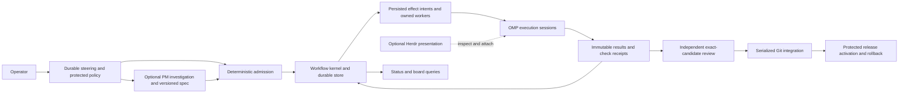

# Foundry audit — 2026-09-12

**Verdict: retain Elixir/OTP and the useful primitives, but rebuild the connections that
make them authoritative. The current execution path does not meet the agreed contract
for autonomous, recoverable engineering work.** Increasing model capability will not
repair these deterministic lifecycle defects.

Foundry contains substantial useful code. Its principal architectural failure is that
the live workflow bypasses safeguards implemented in separate modules. State transitions
are independently implemented in the coordinator, `Coordinator.State`, `Transition`,
and `AgentServer`. They disagree about what happened, what is running, and what a
restart should restore. Review and integration frequently establish that an artifact
has the right shape, without establishing that its claims are true.

This is an audit and repair proposal, not an implementation or a certification of the
running release. No production source was changed, no model was invoked, and no live
pane, daemon, checkout, or event history was stopped or rewritten.

## Contract and evidence boundary

The user-confirmed contract takes precedence over historical role and migration docs:

- Pramāṇa only, one operator and one machine for now; keep the standalone project.
- Autonomous planning, development, independent review, integration, and Foundry
  activation are permitted within durable steering policy.
- Foundry cannot grant itself more authority, weaken mandatory checks, broaden spending,
  or enable paid fallback. Those require an explicit operator instruction.
- Automatic provider changes may use explicitly authorized subscription profiles.
  OpenRouter DeepSeek is manual only. Exhausted eligible subscriptions stop admission.
- Keep OMP and Herdr initially. Roles, execution sessions, and terminal presentation
  must have separate identities. Headless execution is acceptable.
- PM elaboration is conditional on the direction needing investigation or decomposition.
  Deterministic admission, not PM prose, grants permission to execute.
- Successful work includes coherent lifecycle completion and recovery, not just an
  agent saying it finished.

Source baseline: repository HEAD `a3fa302342238ae3d5a133b35bd86f4fa4f13710`, plus
pre-existing working-tree edits in `cli.ex` and `coordinator.ex`. Those edits were
preserved. Existing untracked review artifacts were also preserved. The accompanying
[inventory](audit-2026-09-12/inventory.json) records reviewed source hashes and scope.

Evidence labels below:

- **Exercised:** isolated execution against the working-tree implementation.
- **Source:** a reachable code path establishes the defect; no destructive or paid
  exercise was needed.
- **Gap:** an agreed capability has no complete implementation in the inspected path.
- Recommendations are proposed behavior; they have not been implemented or benchmarked.

The running daemon answered a read-only RPC. At that observation it reported one
`completed` and one `parked` assignment, no pause/stop, and accepted revision
`99faef5832dec3c7039b557bb678f28ae94d0cdd`. Its loaded coordinator module digest differed
from the local test build. Build differences can affect that digest: this is **not** an
identification of the deployed source revision. The isolated results below must not be
presented as a fault-injection test of that running release.

## Coverage inventory

Coverage means subsystem inspection, call-path tracing, and the listed exercises. It
does not mean every possible interleaving, provider, or historical data file was tested.

| Dimension | Inspected surface | Verification and limit |
|---|---|---|
| Product and autonomy | Supplied contract; README; all role files; migration/event docs | Compared authority and delivery claims to executable paths |
| State and event sourcing | Coordinator, State, Transition, Schema, Import, EventLog, Checkpoint, AtomicFile | Replay, invalid log, failed append, retry, PM, review, late-message probes |
| Scheduling and resource ownership | Tick, Scheduler, Policy, Preparation, PM proposal validation | Dependency bypass exercised; capacity and environment propagation traced |
| Execution and recovery | AgentServer, application tree, Herdr adapter/identity/argv/runner, launch/prompt/check/process-group modules | Existing fake-adapter and real local process tests; no model launch |
| Results and review | CLI validators, Handoff, Correction, Reviews/Artifact/Matrix | Stale review attribution, auto-approval, real Git out-of-scope diff probes |
| Integration and activation | State integration, Integration/Pipeline, release config, live watcher | Nonexistent candidate promotion exercised; watcher source review |
| Steering and PM | CLI, steerer/PM roles, PM/Proposal/AttemptCap, HardeningPM | PM replay exercised; planning and policy wiring inspected |
| Provider and cost policy | AgentServer defaults, Quota/Cooldown/Fallback, review matrix, role profiles | Default model exercised; subscription selection absent from live dispatch |
| Operability and observability | Health/status, SystemMetrics, board/view state/view/inspection/findings, telemetry/store/observation/forecast/export, ConsolidatedLog, Improver | Board replay and missing coordinator telemetry exercised; helpers covered by suite |
| Security and trust | RPC wrapper, input handling, privileged effects, cleanup, inspection, event/artifact trust | Harmless interpolation probe; source review of authority and cleanup paths |
| Persistence maintenance | JSONL limits, fsync/error behavior, compaction, snapshots/import/projections | Oversize replay exercised; concurrent compaction/power-loss not tested |
| Relocation and historical compatibility | Relocation and all support modules, Parity, Import, fixtures | Existing local Git move/crash/rollback tests; cross-device failure not exercised |
| Build and dependencies | Standalone mix/config/lock/release files, root toolchain and CI | Forced compile, formatting, isolated suite; no dependency vulnerability scan |
| Executable entry points | All five `foundry/bin/` files, CLI/escript, `pramana_diagnose.py`, application start, release RPC/daemon and overlays, board | Read-only daemon RPC and installed OMP/Herdr help; hazardous live scripts not run; tracked binary metadata inventoried |
| Documentation and tests | All Foundry docs/roles, README, tests/fixtures/support; root project routing, PLAN and CI | Contract discrepancy table; test evidence quality assessed separately from pass counts |

Physical live history, provider credentials, unrelated umbrella/corpus behavior, actual
subscription exhaustion, graphical terminal interaction, machine power failure, and
cross-version deployment rollback were not exercised. No conclusion here claims those
paths work.

## Findings

**P0** means the path can violate spending, acceptance, evidence preservation, or
ownership boundaries. **P1** means lifecycle correctness or recoverability is broken.
**P2** means maintenance, diagnosability, or secondary functionality is impaired.

### F01 — P0: automatic execution selects the explicitly disallowed paid provider

**Exercised A14; source.** `AgentServer.init/1` defaults to
`openrouter/deepseek/deepseek-v4-flash` and `approval_mode: "yolo"`. Tick and both reviewer
launch paths omit `model`, so they inherit that default. Ticket profiles, the review
matrix, and quota fallback logic do not govern these launches. This is a direct policy
violation when dispatch occurs, even though this audit made no provider request.

Source: [AgentServer](../lib/pramana_foundry/agent_server.ex#L60),
[Tick](../lib/pramana_foundry/coordinator/tick.ex#L39),
[review launch](../lib/pramana_foundry/coordinator.ex#L315),
[fallback policy](../lib/pramana_foundry/quota/fallback.ex#L28).

Repair: require a resolved, authorized execution profile before constructing any child.
Missing policy must block admission. Store the exact provider/account billing class,
model, role, reasoning, quotas and limits with the attempt. Do not infer subscription
authorization from a provider name or available API key. Benchmark substitutions later.

### F02 — P0: acknowledged changes can be lost; unreadable history becomes empty state

**Exercised A01, A02, A18.** Coordinator handlers commonly discard `Checkpoint.append`
results and acknowledge the in-memory mutation even if persistence failed. Startup maps
any `Checkpoint.events` error to `[]`. `Import.read_jsonl` rejects the entire file for one
malformed line or when it exceeds the schema read limit; appends have no corresponding
history rotation. Thus both a torn final record and sufficiently large valid history
can produce a fresh empty coordinator.

Source: [startup](../lib/pramana_foundry/coordinator.ex#L121),
[enqueue](../lib/pramana_foundry/coordinator.ex#L259),
[Import](../lib/pramana_foundry/import.ex#L17),
[read limit](../lib/pramana_foundry/schema.ex#L10),
[append](../lib/pramana_foundry/event_log.ex#L6).

Repair: validation → durable commit → apply committed events → acknowledge. A persistence
failure must prevent subsequent effects and admission. Distinguish missing initial store,
recoverable incomplete tail, interior corruption, unsupported versions, and capacity
failure; preserve bytes and report the exact recovery boundary. Never silently reset.

### F03 — P0: CLI submission manufactures identity and disables evidence verification

**Exercised A10; source.** Handoff submission obtains `run_id` and assigned base from
current coordinator state. Review submission similarly substitutes the current run and
handoff commit, even when the submitted file identifies an older candidate. Both use
`skip_git_checks: true`. Both replace check evidence with `[]`.

Consequences: a late review can approve current work it never reviewed; fabricated or
stale commit claims evade Git verification; tickets with real required checks cannot
satisfy this wrapper, while empty-check tickets pass. The low-level review validator
also accepts developer/handoff run identity, rather than requiring a distinct reviewer.

Source: [handoff CLI](../lib/pramana_foundry/cli.ex#L160),
[review CLI](../lib/pramana_foundry/cli.ex#L304),
[review identity](../lib/pramana_foundry/reviews/artifact.ex#L35).

Repair: preserve immutable artifact identity and raw artifact bytes. Bind submission to
an issued role/attempt capability and exact candidate digest. Verify check receipts
generated by the controller. Test-only bypasses must be unavailable through production
submission. A CLI adapter may translate syntax but must not invent evidence.

### F04 — P0: admission can weaken acceptance and scope checks trust self-report

**Exercised A11, A19; source.** A ticket may set `auto_approve: true`; State creates a
synthetic approved review to satisfy integration. Enqueue accepts missing scope/checks/
checkout; PM proposal admission uses a separate, weaker ticket-validation path.
Handoff scope enforcement compares only the developer's `changed_files`, never the
actual Git diff. A real clean Git candidate containing an omitted out-of-scope file
passed the non-bypassed handoff validator in A19.

Missing/nonexistent checkout paths also return success from Git validation. The
`rev-list --count base..HEAD == 1` check is not a proof that base is an ancestor.

Source: [admission](../lib/pramana_foundry/coordinator/state.ex#L61),
[synthetic approval](../lib/pramana_foundry/coordinator/state.ex#L184),
[PM create/amend](../lib/pramana_foundry/pm/proposal.ex#L80),
[Handoff](../lib/pramana_foundry/assignments/handoff.ex#L104).

Repair: derive mandatory gates from protected operator policy, never candidate-controlled
fields. One admission validator must serve CLI and PM. Derive changed paths, renames,
ancestry and candidate tree from Git; compare the full diff against scope and exclusions.
Reviewer isolation must be enforced beyond a role prompt and a writable shared checkout.

### F05 — P0: cleanup does not establish ownership

**Source.** Coordinator orphan cleanup closes untracked panes whose CWD begins with
`/private/tmp`, except two hard-coded pane IDs. That is not a Foundry ownership check.
Developer and reviewer overwrite one shared pane field (A09), so this cleanup may even
classify the other active role's pane as orphaned. AgentServer cleanup bypasses the
typed adapter and closes directly by pane ID.

The companion recovery script is broader: its EXIT trap enumerates and closes every
visible pane, and the script truncates the fixed live event log. It was not run.

Source: [orphan cleanup](../lib/pramana_foundry/coordinator.ex#L892),
[direct close](../lib/pramana_foundry/agent_server.ex#L482),
[test cleanup](../bin/test_daemon_recovery.sh#L24).

Repair: close only a durably owned execution/presentation identity, after reinspection;
record uncertain cleanup for reconciliation. Make the test harness allocate and clean
only its own runtime root, checkouts, release and pane identities.

### F06 — P0: JSON-to-Elixir RPC encoding is executable input

**Exercised A17.** The wrapper JSON-encodes argument strings and inserts them into an
Elixir expression. JSON does not escape Elixir interpolation. The harmless literal
`#{1 + 1}` becomes `2` during evaluation; arbitrary Elixir expressions have the same
entry point. Valid Unicode JSON escapes are also not a general Elixir string codec.

Source: [RPC wrapper](../bin/pramana#L78). This is a correctness and authority-boundary
failure, not a claim that an external attacker accessed the machine.

Repair: transport arguments as inert encoded data and decode them inside a fixed RPC
function. Longer term, expose a small authenticated command protocol; agent commands
must not require access to a general-purpose daemon evaluation credential.

### F07 — P1: runtime and replay use incompatible state machines

**Exercised A03–A07; source.** These are separate discrepancies, not one malformed fixture:

| Transition | Runtime | Replay |
|---|---|---|
| Pause, stop, public admit, reset PM attempts | Changes state | No corresponding persisted event |
| PM create/amend/park | Changes assignment/queue | Stores only `pm.last_proposal` |
| Approved review | Stores review artifact | Marks approved without restoring artifact |
| Valid `rejected` review | Creates correction | Unhandled verdict raises `CaseClauseError` |
| Exhausted malformed handoff | Parks | Requeues regardless of exhausted budget |
| Exhausted malformed review | Parks | Positive retry count restores `handoff_received` |
| Crash retry | Requeues and increments work retry | Sets crashed without restoring retry budget |
| Developer approval completion | Preserves `review_approved` | Completion inference overwrites it with `review` |

`apply_record` skips returned errors, but does not rescue exceptions from `project`.
The separate `projection` cache is not updated along with ordinary live workflow
mutations. Replay also uses current time for some derived fields rather than a stable
sequence-based definition of state.

Source: [Coordinator controls](../lib/pramana_foundry/coordinator.ex#L212),
[Transition](../lib/pramana_foundry/transition.ex#L146), especially review/crash/PM clauses;
[runtime State](../lib/pramana_foundry/coordinator/state.ex).

Repair: one reducer for both normal operation and recovery. Persist actual outcome,
artifact reference, identity, retry disposition, and resulting policy version. Test
live-versus-replayed semantic state after every command, including rejected commands.

### F08 — P1: restart retries before reconciling surviving work

**Exercised A15; source.** Startup first changes every `dispatched` assignment to queued,
then invokes recovery that only considers `dispatched` assignments. The inflight read
path is therefore skipped for those assignments. Registry state starts empty; surviving
AgentServers under the sibling supervisor are not adopted. They retain the old
coordinator PID for lifecycle notifications. No startup continuation launches a missing
reviewer for recovered `handoff_received` work.

Source: [startup order](../lib/pramana_foundry/coordinator.ex#L128),
[inflight condition](../lib/pramana_foundry/coordinator.ex#L940),
[reenqueue](../lib/pramana_foundry/coordinator.ex#L1030),
[supervision](../lib/pramana_foundry/application.ex#L28).

Repair: boot into `recovering`, acquire the writer fence, rebuild, reconcile each
outstanding effect and surviving session, reattach observers, and only then resume
admission. Unknown outcome is a first-class state, not permission to launch again.

### F09 — P1: task identity is incorrectly used as execution identity

**Exercised A08, A09; source.** Launch messages lack run/role. Completion and crash
handlers receive a run ID but do not check it against the active attempt. Both roles
write the developer pane field and both-role registry entries are dropped together on
completion. An obsolete run's timeout can mark a new attempt completed.

No coordinator monitor is installed for AgentServer PIDs. Supervisor limits do not
replace application-level `DOWN` handling, and a hard kill need not execute the child's
`terminate/2`. The child does not trap exits to make the documented supervisor-shutdown
cleanup dependable. Process termination and pane termination remain distinct facts.

Source: [messages](../lib/pramana_foundry/agent_server.ex#L126),
[launch handling](../lib/pramana_foundry/coordinator.ex#L582),
[completion/crash](../lib/pramana_foundry/coordinator.ex#L706).

Repair: identify every observation by execution ID, attempt ID and role; reject stale
state changes while retaining late evidence. Keep multiple role executions per ticket,
monitor children, and reconcile OS/session/pane state separately.

### F10 — P1: timeouts and corrections break the full lifecycle

**Exercised timeout in A08; source for interleavings.** Work and review timeouts emit
`agent_completed`; the coordinator's default branch marks them `completed`. Correction
review both queues the assignment and re-prompts the existing developer. Tick can then
launch another developer and replace run identity. Correction does not cancel the prior
review timer, so a stale timeout can fire during new work.

Reviewer CLI submission calls Coordinator directly, bypassing the reviewer AgentServer's
cleanup path. Reviewer launch failure can enter the generic developer retry path.
Blocked handoffs also enter reviewer launch logic. A successful `auto_approve` handoff
leaves the developer waiting for a review notification that is not sent.

Source: [timeouts/correction](../lib/pramana_foundry/agent_server.ex#L150),
[review forwarding](../lib/pramana_foundry/coordinator.ex#L365),
[review CLI](../lib/pramana_foundry/cli.ex#L320).

Repair: one correction strategy per transition: resume the existing execution or close
it and issue a fresh attempt. Version timers by execution/phase. Distinguish execution
exit, result submitted, blocked, timed out, reviewed, integrated and deployed.

### F11 — P1: dispatch bypasses scheduling, and review can starve at capacity

**Exercised A13; source.** Tick iterates the raw queue and calls State admission directly.
It never consumes `Scheduler.plan_dispatch`, so dependencies, ranking, resource conflicts,
cooldowns and intended worker capacity are not applied. The DynamicSupervisor's cap is
the remaining bound; saturation is treated as a launch failure and consumes retry budget.

With the default child limit, developers waiting for review can fill all slots. Reviewer
start then fails, and no durable pending-review queue retries it when capacity frees.
Ticket environment/resource settings are not passed to pane creation (it receives `%{}`).

Source: [Tick](../lib/pramana_foundry/coordinator/tick.ex#L17),
[Scheduler](../lib/pramana_foundry/scheduler/scheduler.ex#L16),
[pane environment](../lib/pramana_foundry/agent_server.ex#L381).

Repair: make the scheduler the only admission path and reserve capacity for progress
through review. Resource leases must persist across phases that still own the checkout.
Capacity waits are not failed attempts. Preparation and execution must apply the admitted
environment and scoped corpus/database/build resource requirements.

### F12 — P0: integration can declare success without integrating code

**Exercised A10; source.** The pipeline does not create a candidate worktree, merge or
cherry-pick code, or advance an accepted Git ref. It runs commands at a caller-supplied
or default `/tmp/candidate-TASK` path and changes `accepted_revision` in a map. With empty
checks, even a nonexistent candidate is promoted. Missing integration checkout is accepted.
Readiness checks that a review map exists, but does not compare its commit with the
candidate in that gate.

Gate commands run synchronously inside the Coordinator callback using unbounded
`System.cmd`. While a gate runs, pause, stop and health calls cannot be handled; the
default public GenServer call timeout can expire while the operation continues. A
missing executable/path can raise after `integration_started`, leaving a replayed owner
with no deterministic effect reconciliation.

Source: [State integration](../lib/pramana_foundry/coordinator/state.ex#L350),
[Pipeline](../lib/pramana_foundry/integration/pipeline.ex#L51),
[coordinator integration](../lib/pramana_foundry/coordinator.ex#L425).

Repair: serialize an exact Git candidate built from the accepted ref and reviewed change;
run owned checks asynchronously on that tree; atomically compare-and-advance the accepted
ref with recorded receipts. Concurrent candidates need a defined rebase/review policy
when the accepted base moves. A merged tree that differs from the reviewed candidate
requires policy-defined renewed verification. Never label a map update a merge.

### F13 — P0: automatic activation bypasses acceptance and lacks rollback

**Source; gap.** `pramana-live.sh` watches working-tree `lib` edits, attempts to stop the daemon,
overwrites the release and starts it. It does not select an accepted revision, require
independent review or tests, drain owned work, verify state compatibility, or retain an
immutable prior deployment. If a rebuild fails after stop, “retaining previous release”
does not restart the old daemon. `daemon stop` is also not the generated release's normal
top-level stop command, and its errors are ignored. A fixed sleep prints “ready” without
checking health. Changes to config, roles and dependencies are outside the watcher.

The installed generated release script handles `daemon` as start and `stop` as a
separate command, confirming this command-shape discrepancy without executing it.

Source: [live watcher](../bin/pramana-live.sh),
[release configuration](../mix.exs#L11), [runtime revision](../lib/pramana_foundry/status/report.ex#L107).

Repair: a small activation controller outside candidate control selects an immutable
accepted build, checks compatibility, drains/reconciles, switches release, verifies
health, and rolls back to a compatible release on failure. Embed the source/build ID at
build time; current working-directory Git HEAD is not evidence of loaded code.

### F14 — P1: machine-wide singleton protection is not wired into startup

**Source.** `Fence` exists and has local process tests, but Application/Coordinator never
acquire it. A locally registered GenServer only excludes a duplicate in the same VM.
Except for a special case for `board`, ordinary escript commands start Coordinator,
Improver and HardeningPM before CLI dispatch. Even with ticking disabled, coordinator
startup can write recovery events and, with Herdr enabled, perform cleanup.

Source: [Application](../lib/pramana_foundry/application.ex#L6),
[Fence](../lib/pramana_foundry/fence.ex#L32); compiler xref and caller search.

Repair: separate daemon startup from clients and effect-free commands; acquire and
continuously own a machine-wide store fence before recovery or writes. Protect against
a stale owner continuing effects after losing ownership. Test two independent BEAMs
contending for the same isolated runtime root.

### F15 — P1: steering and PM planning are largely contracts without a runtime path

**Gap; source.** State has an empty `steering` list and Schema recognizes control actions,
but CLI has no implemented `steer`, pause/resume/stop command family or policy revision
workflow. PM modules validate proposals and counters; they do not run the proposed
steering → scoped specification → admission → developer process. The launch prompt
provides task/run/checkout, but no full ticket, spec reference or assignment artifact
path. CLI ticket creation supplies no checkout, so Tick repeatedly fails to launch it.

Source: [CLI create](../lib/pramana_foundry/cli.ex#L387),
[developer prompt](../lib/pramana_foundry/agent_server.ex#L439),
[PM facade](../lib/pramana_foundry/pm/pm.ex), [steerer role](../roles/steerer.md).

Repair: persist steering intent, authority changes and spec revisions. Use one accountable
PM execution when elaboration is needed; admit already-specific work directly. Give every
execution an immutable assignment bundle with spec, scope, checks, budgets and submission
identity. Status and priority changes should not require model calls.

### F16 — P1: blocking through the advertised CLI causes retries

**Exercised A12; source.** `handoff block` builds `{outcome, summary, task_id}` while the
blocked validator requires status, schema, run, reason and diagnostic evidence. It is
rejected as malformed and queued for retry. `partial` is allowed by the role/CLI input
but unsupported by the canonical handoff state machine.

Source: [block command](../lib/pramana_foundry/cli.ex#L254),
[blocked validator](../lib/pramana_foundry/assignments/handoff.ex#L15),
[developer role](../roles/developer.md#L24).

Repair: share one submission contract across roles, CLI and coordinator. Exercise the
actual wrapper and canonical validator together, including blocked and partial outcomes.

### F17 — P1: the default board can display an empty system with real tickets

**Exercised A16.** Board event-log fallback returns the entire `%{projection: ..., state:
...}` rebuild result to code expecting a flat state map. The default CLI board chooses
this path. Assignments disappear from display. Error fallback can additionally return
empty tickets with `revisions_match?: true` and no meaningful recovery diagnosis.

Source: [board selection](../lib/pramana_foundry/cli.ex#L75),
[board load/rebuild](../lib/pramana_foundry/board.ex#L649).

Repair: use an explicit versioned query DTO from the authoritative daemon, and a clearly
marked offline projection when unavailable. Always expose freshness, last durable event,
writer identity and actual daemon liveness; empty must not mean unknown.

### F18 — P1: lifecycle telemetry does not reach its intended consumers

**Coordinator emission exercised in A09; source for remaining paths.** Coordinator passes
non-event telemetry maps to `EventLog.append`, which validates them as events and rejects
them. AgentServer command records omit required `command` and add unsupported fields;
the telemetry validator rejects them. Its start/end timestamps also both use emission
time despite a nonzero measured duration.

Even repaired records would not line up: classifiers look for `crash`/`timeout`, while
AgentServer emits `agent_crash`/`agent_timeout`; tick errors live in the coordinator log,
but the classifier receives the telemetry subset. Observation expects top-level `phase`
and `phase_started`/terminal events that the coordinator does not emit. Health returns
three counts, not the advertised status/metrics report, and counts all assignments as
active and registry entries as running without establishing liveness.

Source: [coordinator emission](../lib/pramana_foundry/coordinator.ex#L1070),
[AgentServer emission](../lib/pramana_foundry/agent_server.ex#L499),
[telemetry schema](../lib/pramana_foundry/telemetry/telemetry.ex#L49),
[observations](../lib/pramana_foundry/telemetry/observation.ex#L3),
[Improver routing](../lib/pramana_foundry/improver.ex#L88).

Repair: one typed observation contract and constructor per lifecycle event. Test the
producer → store → query → classifier chain with real production record shapes. Missing
signals must be visible. Tokens and quota remain explicitly unavailable until measured.

### F19 — P1: self-improvement generates false findings and cannot reliably admit repairs

**Source.** Improver's status allowlist omits legitimate current states such as
`handoff_received`, `review_approved`, `integrated` and `completed`. Reviewer registry keys
look like missing assignments, and the orphan classifier destructures registry values as
tuples even though they are PIDs. This can crash the improver during ordinary review.

Proposals reuse `IMPRV-000` through `IMPRV-002`, point to removed `workflow/` paths, omit
checkouts, and may mutually conflict. All new fingerprints are remembered even if the
batch fails or only the first three were proposed, suppressing retry until restart;
the suppression itself is not durable. HardeningPM marks already-complete tickets stale
because “needed no amendment” is treated as “no matching finding.” Its default checks
also target `workflow/`, and one amendment uses an atom key for `acceptance_criteria`.

Source: [proposal builder](../lib/pramana_foundry/improver.ex#L381),
[consistency classifier](../lib/pramana_foundry/improver.ex#L713),
[HardeningPM stale calculation](../lib/pramana_foundry/hardening_pm.ex#L111).

Repair: derive findings from canonical state and typed observations. Persist a finding
ID, evidence range, admission disposition and resolution lifecycle. Only suppress work
after successful admission. Operational recovery uses bounded deterministic actions;
code repair uses the normal reviewed pipeline. No manager hierarchy is necessary.

### F20 — P2: storage and log maintenance do not support unattended operation

**Source; oversize failure exercised in A18.** Event and coordinator logs grow without
rotation. Telemetry rereads and validates the entire file on every append and has a
hard file limit; its compaction helper is not scheduled by the application. Concurrent
append/compaction has no common writer boundary. ConsolidatedLog reads and JSON-decodes
whole files for `tail`; one malformed record raises. Sorting by `at` is incompatible
with canonical telemetry's `started_at`/`ended_at` fields. These are complexity and
correctness findings, not measured performance regressions.

Source: [Telemetry.Store](../lib/pramana_foundry/telemetry/store.ex#L13),
[ConsolidatedLog](../lib/pramana_foundry/consolidated_log.ex#L13),
[EventLog](../lib/pramana_foundry/event_log.ex).

Repair: authoritative sequence numbers, bounded indexed queries, explicit retention and
archival policy, tested snapshots/recovery, and serialized compaction. Keep telemetry
loss policy separate from workflow durability. Publish disk capacity and last durable
commit health before admission fails.

### F21 — P2: relocation safety is weaker than its documented guarantee

**Source; existing same-filesystem tests passed.** Live handles are collected as warnings
but do not participate in movability. Failed disk-space discovery invents headroom.
Failed digest collection becomes an empty map, which disables verification. Recovery
ignores some journal/path-map write failures and converts journal-controlled strings
with `String.to_atom`. Cross-device moves delete the source before the higher layer
verifies the copied digest. Corrupted/untrusted journal paths are not constrained by a
strict recovery schema. Cross-device loss was not exercised.

Source: [Manifest](../lib/pramana_foundry/relocation/manifest.ex),
[recovery/digests](../lib/pramana_foundry/relocation.ex#L159),
[cross-device move](../lib/pramana_foundry/relocation/worktree.ex#L211).

Repair: keep this as an offline, explicitly invoked maintenance tool. Unknown safety
evidence must block a move; validate journals and paths, confirm copied bytes before
source removal, and make rollback refuse collisions. It should not drive ordinary
workflow architecture now that the migration is historical.

### F22 — P1: policy and inspection claims lack an enforcement boundary

**Source; gap.** Agent execution is not isolated from the operator's filesystem authority
or general release RPC. The same repo holds implementation, roles and acceptance checks.
No protected policy store/capability layer prevents a self-modifying candidate from
weakening its own future gates. Inspection advertises local-only distribution and
sanitization, but those strings do not configure listeners. No coordinator
`format_status` redaction is defined; event evidence may contain arbitrary ticket and
artifact payloads. Actual network exposure and secret leakage were not tested.

Source: [inspection claims](../lib/pramana_foundry/board/inspection.ex#L11),
[vm.args](../rel/vm.args), [RPC wrapper](../bin/pramana),
[application](../lib/pramana_foundry/application.ex).

Repair: define the threat model as fallible local coding agents, not hostile multi-user
tenancy. Nevertheless, protect policy changes, acceptance and release activation with
controller-owned capabilities and files outside candidate write scope. Enforce and
inspect actual listener binding. Redact both normal telemetry and crash/inspection
output; preserve raw evidence only in explicitly controlled artifacts.

### F23 — P1: tests and docs overstate end-to-end completion

**Exercised suite/build; source.** The clean suite passes while the separate audit probes
reproduce fundamental defects. Existing coordinator tests mostly invoke state APIs and
skip Git or mock gates; AgentServer tests use fake Herdr. The purported pane-leak test
only asserts `:ok == :ok`, and the recovery test never performs the claimed restart and
review continuation. The shell recovery exercise has broad cleanup and printouts rather
than decisive lifecycle assertions. Root CI runs the umbrella, not this standalone suite.

Source: [daemon tests](../test/pramana_foundry/daemon_recovery_test.exs#L33),
[engine tests](../test/pramana_foundry/coordinator/engine_test.exs),
[CI](../../.github/workflows/ci.yml).

Repair: retain useful unit tests but gate releases on one real executable workflow,
every restart boundary, stale messages and artifacts, actual Git promotion, and owned
cleanup. Maintain a separate isolated live provider conformance suite. Never count a
placeholder or printed “complete” as a tested capability.

### F24 — P2: additional executable and dependency artifacts have unclear authority

**Source/inventory.** Git tracks both `foundry/pramana_foundry` (a binary escript) and
`foundry/deps/owl/`, while the root ignore rules cover root dependencies and Foundry
build output but not these artifacts. Source, tracked executable and generated release
are separate executable versions without a common build manifest. Vendoring is not
inherently a defect, but the documented source/lockfile boundary does not explain it.

`pramana_diagnose.py` remains a separate diagnostic implementation: it defaults to an
old supervisor root, expects `state.json` and a JSON PID lock, and recommends retired
`bin/pramana-supervisor` commands. Those inputs do not match current event sourcing or
Fence's textual owner token. `Parity` also still imports the retired Python supervisor;
its shadow function reports zero effects without actually comparing live semantics.

Source: [diagnostic](../pramana_diagnose.py#L116),
[Parity](../lib/pramana_foundry/parity.ex#L10),
[ignore rules](../../.gitignore), tracked-file inventory.

Repair: choose explicit vendored-versus-lockfile dependency policy, produce executable
artifacts with source/build IDs, and archive or replace legacy diagnostic/parity routes.
Use the canonical read-only status contract in every client. No vulnerability assessment
of OWL or the installed OMP/Herdr distribution is implied by this audit.

## Documentation discrepancies to resolve

| Document claim | Audited situation | Required treatment |
|---|---|---|
| README: durable/fenced/checkpointed live dispatcher | Several primitives bypassed by current live path | Qualify current guarantees and link this audit |
| MIGRATION: unknown authority/versions fail closed | Loader errors reset; reducer skips returned errors | Retain historical intent, publish new authoritative recovery contract |
| EVENT_SOURCING: every mutation durable; complete reconstruction | Controls, PM work, review artifacts and retry dispositions lost | Replace design examples with commit-checked reducer contract |
| EVENT_SOURCING: invalid events skipped safely | `project` exceptions can crash; file import rejects entire log | Separate corruption policy from schema migration |
| EVENT_SOURCING: gates cannot be skipped | `skip_git_checks`, missing paths, `auto_approve`, empty checks | Document only enforced production guarantees |
| Developer role: timeout returns work to queue | Timeout becomes completed | Fix code and role contract together |
| Developer/reviewer role artifact shapes | CLI and canonical validators disagree | Generate examples/schema from one contract |
| PM role: profiles/checks and full planning lifecycle | Profiles unused; no active main PM execution loop | Separate intended role policy from implemented behavior |
| Steerer role references old `bin/pramana-supervisor`, `automation/*` | Old control paths no longer provide this contract | Replace with durable steering interface and current commands |
| OBSERVABILITY: health metrics and lifecycle telemetry | Health counts only; rejected/mismatched records | Contract tests and generated examples |
| README/MIGRATION: implemented cutover/rollback modules | Referenced cutover tree absent from current source | Date archival claims; remove current API promises |
| Legacy Python diagnostic: supervisor state and recovery commands | Different store/lock shape and retired commands | Archive it or route through current status API |
| Root guide: Foundry test count and only-Elixir runtime | Suite differs; Python bridges, Herdr/OMP and watcher dependencies remain | Distinguish Mix dependency boundary from runtime prerequisites |

Do not rewrite history as though these guarantees were always implemented. Use a small
Foundry current-status document and one living plan, and label migration tickets historical.
There should be one canonical status vocabulary, event schema registry, command API,
artifact schema and policy schema. Generate tables/examples where possible (project rules
8, 60, 63, 79); each capability claim needs an executable entry-point acceptance test.

## Target architecture and what to keep

Keep a single local OTP application with a small durable workflow kernel. A central
GenServer is acceptable if it serializes short decisions, rather than running shell
commands and reconstructing independent versions of the state machine. Do not create
distributed services or a generic multi-repository plugin framework for this phase.

These are ownership boundaries, not separate services. Suggested entities:

| Entity | Owns | Stable relationship |
|---|---|---|
| Objective/spec revision | Outcome, constraints, acceptance policy reference | One objective can produce several admitted tickets |
| Ticket | Scope/dependencies and desired result | Has multiple immutable attempts; does not own a pane |
| Attempt | Assigned base/spec/policy/profile, budget, terminal disposition | Owns executions and result artifacts |
| Execution | Role, session/backend identity, process observations, deadline | Developer, reviewer and PM executions are distinct |
| Presentation | Pane and terminal identities, attachment state | Optional; closure does not decide ticket outcome |
| Check run | Exact argv/environment/tree, timestamps, exit receipt, output digest | Controller-generated evidence, not agent assertion |
| Candidate/review | Exact commit/tree and independent verdict/check receipts | Changed candidate invalidates prior acceptance as policy requires |
| Integration | Input accepted ref, reviewed change, resulting tree/ref | A serialized, recoverable effect |
| Deployment | Immutable build, loaded revision, state compatibility, health/rollback | Separate from accepted source revision |
| Policy revision/control | Operator authority, cost limits, pause/drain/cancel | Explicit actor and scope; cannot be broadened by a candidate |

**Keep:** standalone OTP boundaries, pure scheduling/conflict logic after wiring fixes,
strict artifact validation intent, typed Herdr identity/argv, process-group/check
primitives after conformance review, atomic-file and relocation tests, OWL board rendering,
telemetry schemas that distinguish missing metrics, and bounded correction concepts.

**Replace or consolidate:** duplicated mutation/replay logic, task-keyed execution
registry, wrapper-synthesized evidence, memory-only integration, mutable-source watcher
activation, inference of authority from pane CWD, and fixed improver ticket IDs.

**Retire from the active design:** Python-migration parity promises for absent components,
hard-coded `workflow/` paths, requirement to keep developers alive throughout review,
and the assumption that pane visibility proves process or work liveness. Keep historical
data and useful offline tools without carrying migration architecture into every launch.

### Event sourcing decision

Do not equate event sourcing with JSONL. The essential requirement is recoverable
accepted decisions and attributable effects. The current reducer duplication would also
be incorrect with an embedded database.

The smallest immediate repair is a single reducer and checked persistence behind one
writer. For the durable end state, prefer a local transactional store for workflow state,
events, effect intents and receipts, with JSONL as an export/diagnostic format. This is a
design recommendation, not a measured storage comparison or a selected dependency.

Before selecting storage, implement the same failure-conformance cases against a small
prototype: commit/ack crash boundaries, two writers, full disk, torn records, snapshots,
upgrade/downgrade and interrupted compaction. A journal can remain if it passes and its
operational burden is acceptable. Neither option makes external effects exactly-once;
those require idempotency keys or explicit unknown-outcome reconciliation.

### OMP and Herdr decision

Keep OMP as the execution harness and Herdr as the current presentation backend during
repair. Installed `omp --help` identifies v18.1.19 and advertises `--print`,
`--mode json|rpc|rpc-ui`, `--resume`, `--session-dir`, `--max-time`, profile selection,
and a `usage` command. Installed Herdr help confirms OMP as a supported agent kind.
This establishes an interface surface for a headless spike; it does not establish
reliable reconnect, cancellation, usage accounting or subscription entitlement.

Define a narrow execution interface: start, observe, submit prompt with identity,
interrupt, reconcile, and close an owned execution. Put pane creation/attachment behind
a presentation interface. First prove that one OMP session can finish and be inspected
without a pane, then test disconnect/reconnect and quota reporting. Use an explicit
role-to-authorized-profile order until benchmarks support a replacement matrix. Quota
estimates must carry freshness and uncertainty; absence of a signal is not permission
to switch to billed credentials.

## Ordered repair plan and acceptance gates

Do this as successive small changes to the existing project, not a wholesale rewrite.
No implementation time or token estimate has been measured.

| Order | Deliverable | Exit evidence |
|---|---|---|
| 1 | Protect spending, submission, cleanup and activation boundaries (F01–F06, F12–F14, F22) | No implicit paid launch; no artifact identity substitution; no foreign pane close; no raw-source activation; exclusive writer; failed persistence cannot acknowledge |
| 2 | One state reducer and durable controls (F02, F07) | Command/live/replay semantic equivalence; all accepted verdicts replay; exhausted budgets stay exhausted; PM work survives restart |
| 3 | Attempt/execution identities, ownership and recovery (F08–F11) | Restart at every effect boundary; late messages harmless; hard-killed children observed; one correction owner; review makes progress at capacity |
| 4 | Verified artifacts and real Git integration (F03, F04, F12, F16) | Actual wrapper-to-controller flow; out-of-scope diff rejected; candidate/review/check receipts match; accepted Git ref advances only on gates; stop remains responsive |
| 5 | Durable steering, conditional PM and bounded providers (F01, F15) | Operator control recorded; PM cannot broaden policy; full spec reaches developer; subscription exhaustion pauses affected work; retries bounded across restarts |
| 6 | Autonomous immutable release activation (F13, F22) | Build accepted SHA, drain/reconcile, activate, prove loaded build and health; fail activation and recover compatible code/state without erasing evidence |
| 7 | Observability and constrained improvement (F17–F20) | Real lifecycle appears correctly on board/logs; classifiers consume emitted schemas; no duplicate/lost repair proposals; disk and cost limits visible |
| 8 | Docs, maintenance and independent Foundry CI (F21, F23, F24) | Docs match exercised commands; fresh isolated suite; lifecycle conformance; owned live-provider smoke; historical migration claims dated; executable provenance explicit |

Documentation and relevant tests should accompany each repair, rather than waiting for
step 8. Keep the highest-priority gate policy outside self-modifiable candidate scope.
Autonomous merging and activation can remain the goal: each stage needs deterministic
proof and a bounded failure outcome, not routine human approval.

The decisive end-to-end acceptance scenario is: steer an objective; optionally elaborate
it; admit a ticket; launch an authorized subscription execution; submit a real commit;
request one correction; independently review the exact corrected candidate; integrate
the verified tree; activate a Foundry change; then repeat with restarts between each
durable decision and external effect. Add variants for blocked work, exhausted quota,
capacity saturation, stale artifacts, partial writes, lost observers and failed activation.
Check both resulting Git/code state and absence of unintended owned or foreign processes.

## Verification record

All measurements below are observations from this audit, not generated corpus figures.

- Forced compilation: `MIX_ENV=test mise exec -- mix compile --force --warnings-as-errors`
  passed. This does not validate lifecycle guarantees.
- Formatting: `MIX_ENV=test mise exec -- mix format --check-formatted` failed on existing
  source/test formatting. No bulk formatting was applied.
- Existing suite, seed `12092026`, isolated runtime, Herdr/tick disabled, integration
  tags excluded: first run reported **294/304 passed, 2 excluded**, with ten relocation
  setup failures (`nothing to commit`) from pre-existing temporary directories.
- Rerun with a fresh audit-only `TMPDIR`: **304 passed, 2 excluded**, 52.3 seconds as
  reported by ExUnit. This resolved the setup failures; it does not turn component
  tests into a successful live lifecycle. VM-local unique integers are insufficient
  isolation for retained temporary paths across separate invocations.
- [Characterization probes](audit-2026-09-12/probes.exs): **19 passed**. They deliberately
  assert observed defects. They are outside `test/` and are **not** desired regression
  expectations. A19 uses an actual temporary Git repository with Git checks enabled.
  A17 evaluates only harmless arithmetic to demonstrate the codec problem.
- Compiler xref and source caller inspection confirm the live path does not use the
  checkpointed launch/prompt helpers or the owned check runner, and startup does not
  acquire Fence. Scheduler is exposed as a query, not consumed by Tick.
- Installed OMP/Herdr help inspected; daemon aggregate state read via RPC. No model
  tokens spent by the audit. No actual provider failover, activation, network-binding
  guarantee, power-loss recovery or unattended soak claimed.

The [verification notes](audit-2026-09-12/verification.md) contain commands and local log
locations. The report and evidence establish a repair baseline; they do not claim the
unimplemented repair plan is complete.
